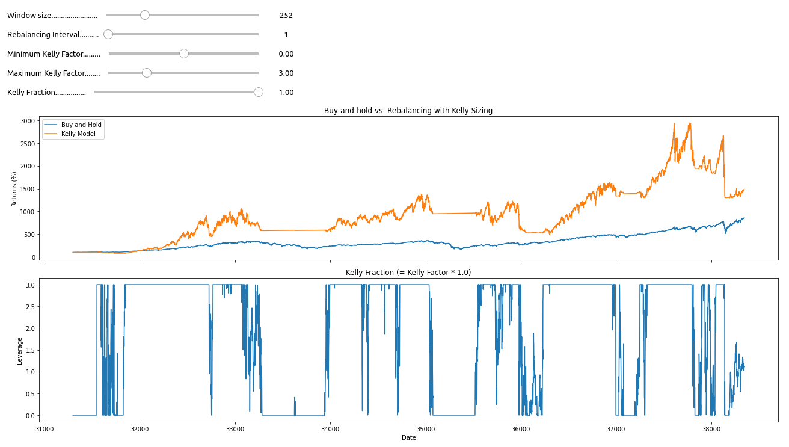
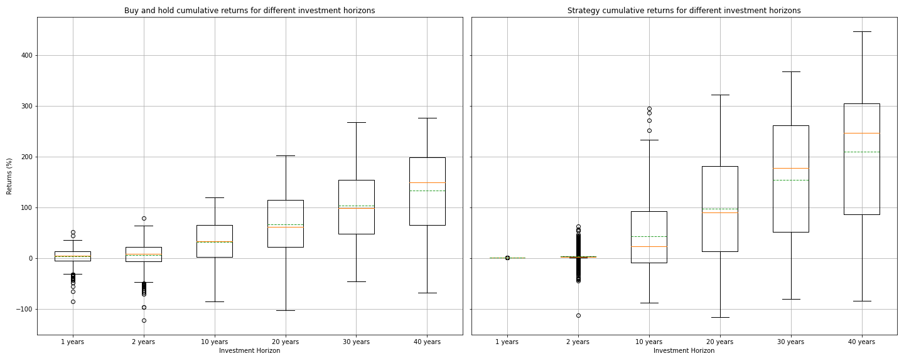
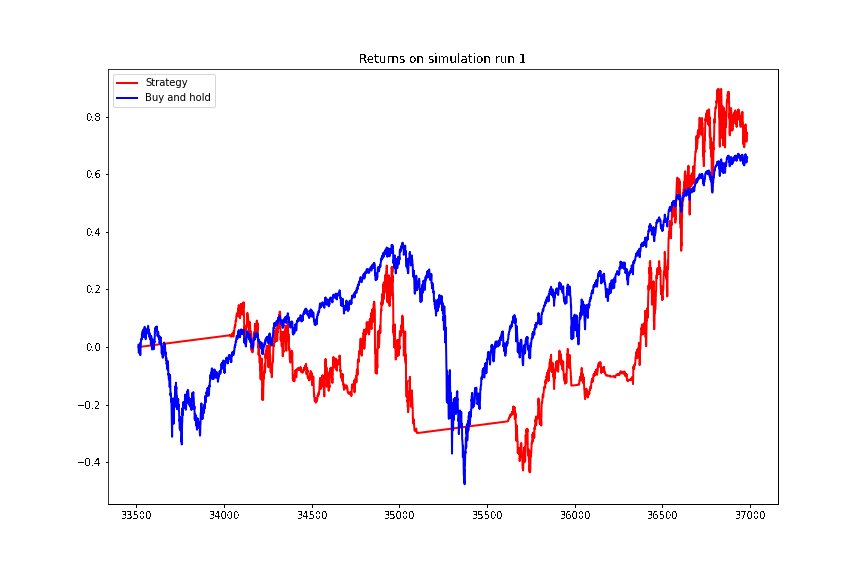

# trading-sp500

Testing a Kelly Sizing based betting strategy on the s&amp;p 500

Run the notebooks with binder [](https://mybinder.org/v2/gh/patrickfrank1/trading-sp500/main)


## Motivation

I got excited about this project while reading [Paul Butler's Article](https://explore.paulbutler.org/bet/) on [Kelly](https://en.wikipedia.org/wiki/Kelly_criterion) sized bets. It offers an excellent introduction into the topic and I encourage you to read it until the very end.

This gambling strategy only works on games with a expected positive return in the long run, so natually I thought "Can this strategy be applied to trading the S&P 500?". As as a google search revealed some people have had the same idea before and the foundations were already laid ouf by Edward Thorp and Sheen Kassouf in the 1960s.

I stumbled across an excellent bolg post abou algorithmic trading, which can be found here: https://raposa.trade/blog/how-to-improve-your-trading-system-with-the-kelly-criterion/. This article was also the basis for my experiments in this repository. Here I extend the previous results by:

- analyses on much more historical data (S&P 500 from 1885 to 2022)
- an interactive strategy simulator [1]
- more robust backtesting simulations agains historical data [2]

Further reading:
- https://en.wikipedia.org/wiki/Kelly_criterion
- https://en.wikipedia.org/wiki/Edward_O._Thorp
- https://caia.org/sites/default/files/AIAR_Q3_2016_05_KellyCapital.pdf
- https://www.eecs.harvard.edu/cs286r/courses/fall12/papers/Thorpe_KellyCriterion2007.pdf

## Contents

The the contents of the four notebooks in this repository are briefly summarized below:

1. Data Analysis: prepare the data for later analysis, plot summary statistics
2. Interactive Kelly Strategy: examine different strategies interactively by tuning the important parameters of the strategy
3. Analysis Kelly Strategy: My own analysis using notebook 2 and building on the analysis of the [raposa blog post](https://raposa.trade/blog/how-to-improve-your-trading-system-with-the-kelly-criterion/)
4. Robustness analysis: backtesting on historical data

## Results

You can view the notebooks with simulations plots and explainations directly here in github.

If you want to dig deeper and use the interactive widget or analyse the data youself download the repository  and install the dependencies as follows.

``` bash
git clone https://github.com/patrickfrank1/trading-sp500.git
cd trading-sp500
python -m pip install -r requirements.txt
```

Alternatively you can also run the notebooks using [google colab](https://colab.research.google.com/). 

### Interactive strategy builder

In the picture below is a screenshot of the interactive widget.

[1]: 

### Optimal Kelly strategy

The main finding of the analysis in notebook 3 is that daily portfolio rebalancing is strictly nessecary to run a profitable Kelly Sizing strategy. Also positions need to be leveraged at times if you want to beat the baseline buy and hold strategy. The leaverage and therefore the risk that is taken on, can be adjusted.

### Robustness of the strategy on historical data

The strategy is more profitable than buy and hold on the long run only. That is an investment horizon of 30+ years.

[2]: 

The simulation runs can be ploteed and further analysed.

[3]: 

## Run via docker

You can run a small webserver via docker which will provide you with daily calculated kelly fractions.

Build the docker image with:

    docker build --tag kelly_fraction:latest .

Run the image:

    docker run -d -p 8080:9009 --restart=always kelly_fraction:latest
